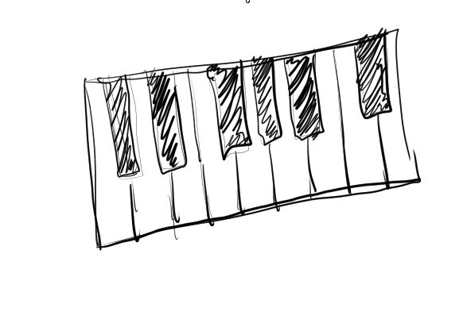
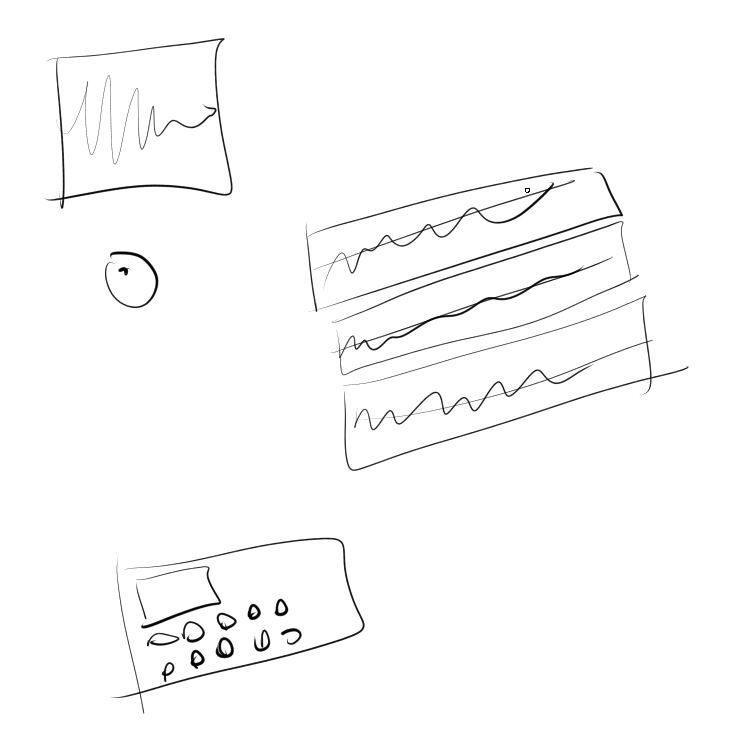

05/07/2024

I got sidetracked with the modular pi cam project but... I was thinking about this

The piano thing... I have a touch screen device still the ASUS C100P which is a chromebook from 2012 lol

I have linux running on it via Crosh will see if that can make a go binary or execute on it somehow

Then I can play a little piano on that screen

---

05/05/2024

9:29 PM

I was thinking about this today and I think it makes sense to make one of those small portions of a piano keyboard

idk how to play music so yeah I'm just going at this blind

---

05/04/2024

7:32 PM

My YouTube videos are pretty dry and rather than source music from people that know how to make music (copyright free), I'll make my own. At the same time learning Go (it's easier than Rust).

Watching this video for ideas

https://www.youtube.com/watch?v=3-PGN23rjzA

Like how to make sound lol

10:51 PM

I'm tired, didn't make much progress, didn't get far in that video

So far I don't really have a vision yet, I see like soundboard designs in my mind

Teenage Engineering is cool regarding hardware designs

This will be a desktop GUI app though because I want to work with that

idk I haven't worked on a project in a bit mostly dealing with being broke

trying to freelance but I haven't succeeded in that (landed a paying gig) though I have dumped days of time into potential contracts
